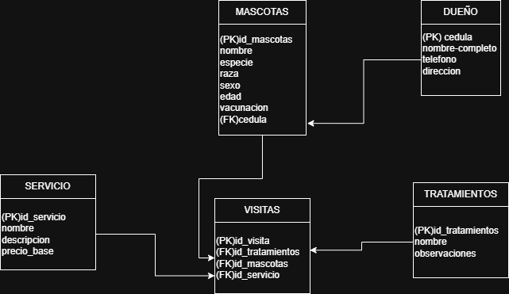

# 🐾 Veterinaria Mi Mejor Amigo

Este proyecto representa una solución completa de base de datos para la veterinaria **“Mi Mejor Amigo”**, abarcando desde el diseño lógico y físico hasta la carga de datos y la ejecución de consultas SQL avanzadas.

Está pensado como un caso de estudio académico, ideal para practicar conceptos de modelado relacional, normalización, inserción de datos y optimización de consultas.

---

## 📘 Descripción General

La veterinaria “Mi Mejor Amigo” desea sistematizar la información de sus clientes, mascotas, servicios y personal médico. Este proyecto proporciona:

- Un **modelo entidad-relación** que representa las entidades clave y sus relaciones.
- La **estructura de base de datos** 
- Un conjunto de **consultas SQL** que permiten explotar la base de datos 

---

## 📂 Contenido del Proyecto

| Archivo            | Descripción                                                                       |
|--------------------|-----------------------------------------------------------------------------------|
| `DDL.sql`          | Definición de todas las tablas, relaciones, claves primarias y foráneas.          |
| `DML.sql`          | Inserciones de datos simulados para probar la base de datos.                      |
| `DQL.sql`          | 15 consultas SQL que incluyen funciones de agregado, subconsultas, alias y más.   |
| `diagramaER.png`   | Diagrama entidad-relación del modelo relacional (ERD).                            |
| `README.md`        | Este archivo con la documentación del proyecto.                                   |

---

## 🖼️ Diagrama Entidad-Relación

El diagrama ER ilustra cómo se relacionan las entidades **Clientes**, **Mascotas**, **Veterinarios**, **Servicios**, entre otras.

## 🎥 Video explicativo

Explicación del funcionamiento de las consultas:

🔗 [Ver en Drive](https://drive.google.com/drive/folders/1uJz48KynfsIBtW-YtRCaYPLAiwI5cpdB?usp=sharing)

